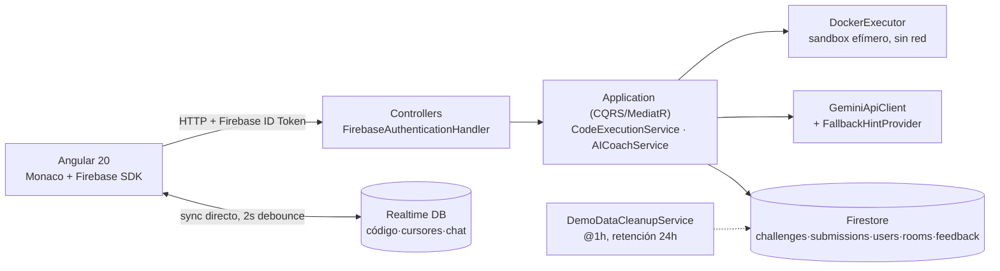

# CodeSync

> **IDE colaborativo para aprender a programar**, construido alrededor de un problema difícil:
> **el cupo de una sala de a lo sumo 4 personas nunca puede confiar en un read-then-write** — si
> dos usuarios piden el último lugar al mismo tiempo, un `Count < 4` leído por los dos deja entrar
> a los dos. El fix no es una nota en un README, es una transacción de Firestore verificada con un
> test de 2 joins concurrentes.

 · 

Stack: **.NET 8 (Clean Architecture + CQRS) · Angular 20 standalone · Firestore + Realtime DB ·
Docker sandbox · Gemini API**

---

## ¿Qué resuelve?

Un IDE colaborativo con desafíos de código tiene tres problemas que un CRUD no tiene:

1. **Concurrencia real en las salas** — el cupo máximo de 4 usuarios por sala se cierra con una
   transacción de Firestore (`RunTransactionAsync`), no con un `if (count < 4)` optimista. La
   primera versión sí era optimista: bajo 2 joins simultáneos por el último cupo, ambos leían
   `Count < 4` y ambos se agregaban (last-write-wins, el segundo pisaba al primero). El test de
   integración con 2 joins en paralelo contra el emulador de Firestore fue lo que lo detectó — ver
   [`ARCHITECTURE.md`](./ARCHITECTURE.md#4-transacción-de-firestore-en-el-join-a-sala-sella-el-mvp).
2. **Ejecutar código de usuarios no confiables, en un sandbox real** — 7 lenguajes (Python,
   JavaScript, Ruby, Java, C#, HTML, CSS) corren en contenedores Docker efímeros con
   `NetworkMode=none`, 256MB sin swap, timeout 5s con SIGKILL, filesystem read-only, `User=nobody`
   y `PidsLimit=50`. HTML/CSS se califica con Chromium headless real (Playwright) contra
   aserciones de DOM, no con un regex sobre el markup.
3. **Feedback que no se cae si el proveedor de IA falla** — el IA Coach (Gemini) tiene rate limit
   de 1 request/min por usuario y, si Gemini no responde o no hay API key configurada, cae a hints
   pre-generados por dificultad. La corrida nunca se rompe por una IA caída.

### Features

- **Editor Monaco sincronizado en tiempo real** vía Firebase Realtime DB — código, cursores
  remotos y chat por sala, auto-save con debounce de 2s.
- **34 desafíos sembrados** en 7 lenguajes (Python, JavaScript, HTML, CSS, Ruby, Java, C#), con
  test cases visibles/ocultos y niveles de dificultad.
- **Ejecución sandboxed en Docker** por lenguaje, con límites de red/memoria/tiempo/privilegios
  (detalle completo en [Limitaciones conocidas](#limitaciones-conocidas) y `ARCHITECTURE.md`).
- **IA Coach (Gemini)** con feedback en español, rate limit 1/min y fallback a hints pre-generados.
- **Salas colaborativas** — código de invitación de 6 caracteres sin ambiguos (`0`/`O`, `1`/`I`),
  cupo máximo de 4 serializado por transacción Firestore, chat y cursores en vivo.
- **Ranking global por nivel** — leaderboard ordenado por XP acumulado (`GetLeaderboardHandler`),
  agregado post-MVP a pedido.
- **Auth Firebase completo** — Google, GitHub y email/contraseña, cambio de contraseña, avatar
  con validación de extensión real (no solo content-type).
- **Auto-limpieza de datos de demo** — `DemoDataCleanupService` borra submissions/salas/feedback
  con más de 24h cada hora, para que un proyecto público no acumule basura indefinidamente.

### En números

**64 tests backend** (unit + integración contra Firestore emulator real, sin mocks de BD) + **8
tests E2E** (Playwright, flujo completo signup → resolver desafío → sala colaborativa → cambio de
contraseña → avatar, contra emulators de Firebase + Docker real) · 5 controllers, 14 handlers CQRS
(MediatR) · 7 lenguajes de ejecución sandboxed · arquitectura completa Api→Application→Domain
(puro)←Infrastructure.

---

## Arquitectura (resumen)

El detalle —por qué Firestore y no SQL, por qué Gemini y no otro proveedor, por qué
`RunTransactionAsync` y no un lock optimista, qué se sacrificó a propósito— está en
[`ARCHITECTURE.md`](./ARCHITECTURE.md).



```
codesync/
├── apps/
│   ├── api/                    .NET 8 — Clean Architecture + CQRS (MediatR)
│   │   ├── CodeSync.Api/              Controllers HTTP + FirebaseAuthenticationHandler
│   │   ├── CodeSync.Application/      Handlers CQRS + CodeExecutionService + AICoachService
│   │   ├── CodeSync.Domain/           Entidades puras, sin dependencias externas
│   │   ├── CodeSync.Infrastructure/   FirestoreRepositories, DockerExecutor, GeminiApiClient
│   │   └── CodeSync.Tests/            64 tests (unit + integración contra Firestore emulator)
│   └── web/                    Angular 20 standalone
│       ├── src/app/            core, editor, collaboration, dashboard, auth, shared, layouts
│       └── e2e/                8 tests Playwright (auth, ejecución, salas, avatar, password)
├── docs/design-tokens.md       Sistema de diseño: paleta MD3 dark, tipografía, spacing
└── LICENSE                     Propietario — todos los derechos reservados
```

---

## Cómo correr

Requisitos: .NET 8 SDK, Node 20+, Docker, un proyecto de Firebase (Realtime DB + Firestore + Auth)
y una API key de Gemini (opcional — sin ella, el Coach usa fallback). Detalle completo en
[`RUN.md`](./RUN.md).

```bash
# HTML/CSS se califica con Chromium headless — buildear la imagen local una sola vez
cd apps/api/CodeSync.Infrastructure/Execution/docker
docker build -t codesync-html-runner:1.48.0 -f html-runner.Dockerfile .

# Backend
cd apps/api
dotnet run --project CodeSync.Api

# Frontend (otra terminal)
cd apps/web
npm install && npm start
```

- Web: http://localhost:4200 — API: http://localhost:5117 (Swagger en `/swagger`)

**Demo en vivo:** todavía no deployado — proyecto de portfolio corrido en local. Ver
`ARCHITECTURE.md` → "Qué mejoraría con más tiempo" para el plan de deploy.

---

## Tests

```bash
# Backend — 64 tests (necesita Docker corriendo)
cd apps/api && dotnet test

# Frontend (unit) — 2 tests
cd apps/web && npm test -- --watch=false --browsers=ChromeHeadless

# E2E — 8 tests (necesita Firebase emulators + API apuntando a ellos, ver playwright.config.ts)
cd apps/web
npx firebase-tools emulators:start --only auth,firestore,database --project demo-codesync-test
# en otra terminal, con FIREBASE_AUTH_EMULATOR_HOST/FIRESTORE_EMULATOR_HOST seteados:
npx playwright test
```

La suite de integración corre contra **Firestore emulator real** (sin mocks de BD) y el sandbox de
ejecución corre **contenedores Docker reales** — más lento que mockear, pero es lo único que
prueba de verdad que el timeout, los límites de memoria y el aislamiento de red funcionan.

---

## Limitaciones conocidas

Ninguna de estas es un descuido — son simplificaciones deliberadas con un techo conocido:

- **Rate limiter del IA Coach en memoria** (`InMemoryRateLimiter`) — válido para una sola
  instancia; resetea en cada redeploy. Escalar a réplicas necesita Redis.
- **Sin deploy a producción todavía** — corrido en local; el plan de deploy está en
  `ARCHITECTURE.md`.
- **Docker, no una VM**, para el sandbox — trade-off consciente costo/complejidad vs. seguridad.
  Riesgo residual: Docker escape o vulnerabilidades del intérprete, ambos parcheables.
- **Sin tipos compartidos entre backend y frontend** — DTOs (.NET) y interfaces TypeScript se
  mantienen a mano; NSwag es la mejora natural si el proyecto crece.
- **Go no está en el sandbox** — evaluado y descartado por ahora: `go run` necesita un tmpfs
  ejecutable (incompatible con el `noexec /tmp` del contenedor) y compilar en frío toma ~4s, más
  de la mitad del timeout de ejecución por default.

---

## Licencia

© 2026 Mateo Pavoni. Todos los derechos reservados. Software propietario, publicado solo con fines
de evaluación/portfolio. Prohibida su copia, redistribución o reuso sin autorización escrita. Ver
[LICENSE](./LICENSE).
